# 🅿️ Parking&CO

<p align="center">
  
  
  
  
</p>

<p align="center">
  <strong>Sistema de Gestión de Aparcamientos Multi-Localización</strong><br/>
  <em>Aplicación de escritorio Java Swing con soporte multi-idioma, filtros avanzados y persistencia de datos</em>
</p>

---

## 📋 Tabla de Contenidos

- [🎯 El Problema y la Solución](#-el-problema-y-la-solución)
- [✨ Características Principales](#-características-principales)
- [🛠️ Tech Stack](#️-tech-stack)
- [📦 Instalación y Quick Start](#-instalación-y-quick-start)
- [🏗️ Arquitectura del Sistema](#️-arquitectura-del-sistema)
- [📊 Modelo de Datos](#-modelo-de-datos)
- [🎨 Interfaz de Usuario](#-interfaz-de-usuario)
- [🌐 Sistema de Internacionalización](#-sistema-de-internacionalización)
- [⚙️ Configuración Avanzada](#️-configuración-avanzada)
- [📁 Estructura del Proyecto](#-estructura-del-proyecto)
- [📝 Licencia](#-licencia)

---

## 🎯 El Problema y la Solución

### El Problema

Los usuarios que buscan aparcamiento en ubicaciones con alta demanda (hospitales, centros comerciales, parques, museos) enfrentan:

- **Falta de visibilidad** sobre plazas disponibles en tiempo real
- **Necesidades específicas** no atendidas (acceso rápido, cercanía a entrada/salida, sin columnas)
- **Barreras idiomáticas** en sistemas de información
- **Pérdida de tiempo** buscando plazas entre opciones ocupadas

### La Solución: Parking&CO

Parking&CO es un **sistema de gestión de reservas de aparcamiento** que proporciona:

- 🗺️ **Visualización en grid 10x10** del estado de cada plaza en tiempo real
- 🔍 **Filtrado inteligente** por tipo de vehículo (coche/moto) y especificaciones
- 🌍 **Soporte multi-idioma** dinámico (Español, Inglés, Francés, Italiano)
- 💾 **Persistencia automática** de preferencias del usuario
- 🔒 **Control de matrículas** para evitar reservas duplicadas

---

## ✨ Características Principales

| Característica | Descripción |
|----------------|-------------|
| **Multi-Parking** | Gestión de 4 ubicaciones: Hospital, Centro Comercial, Parque, Museo |
| **Grid Visual 10x10** | 100 plazas por parking con código de colores de estado |
| **Filtros Avanzados** | Tipo de vehículo + 4 especificaciones combinables |
| **Multi-idioma Dinámico** | Cambio de idioma en caliente sin reiniciar la aplicación |
| **Preferencias Persistentes** | Recuerda configuración, matrícula y filtros del usuario |
| **Validación de Matrículas** | Previene reservas duplicadas |

---

## 🛠️ Tech Stack

| Tecnología | Propósito |
|------------|-----------|
| **Java 17+** | Lenguaje de programación principal |
| **Java Swing** | Framework de interfaz gráfica (JFrame, JDialog, JPanel) |
| **AWT** | Graphics2D para renderizado de iconos dinámicos |
| **I/O Streams** | BufferedReader/PrintWriter para persistencia de archivos |
| **Collections Framework** | Vector, ArrayList, HashSet para gestión de datos |

---

## 📦 Instalación y Quick Start

### Prerrequisitos

- **JDK 17** o superior instalado
- **VSCode** con extensión Java (recomendado) o cualquier IDE Java

### Compilación y Empaquetado

```bash
# 1. Clonar el repositorio
git clone https://github.com/tu-usuario/Parking-CO.git
cd Parking-CO

# 2. Compilar con VSCode (usar la función de compilación integrada)
# O compilar manualmente:
javac -d bin src/*.java

# 3. Empaquetar en JAR ejecutable
jar cvfm "Parking&CO.jar" MANIFEST.MF -C bin/ .
```

### Ejecución

```bash
# Ejecutar la aplicación
java -jar "Parking&CO.jar"
```

> **⚠️ Importante:** Ejecutar desde el directorio raíz del proyecto para que los paths relativos a `bin/data/` y `bin/media/` funcionen correctamente.

---

## 🏗️ Arquitectura del Sistema

### Diagrama de Clases Principal


### Flujo de Navegación de la Aplicación

```mermaid
flowchart TD
    A[🚀 Inicio] --> B[primeraVista]
    B --> C{Selección de Parking}
    
    C -->|Hospital| D1[segundaVista - Hospital]
    C -->|Centro Comercial| D2[segundaVista - C.Comercial]
    C -->|Parque| D3[segundaVista - Parque]
    C -->|Museo| D4[segundaVista - Museo]
    
    D1 & D2 & D3 & D4 --> E{Acciones}
    
    E -->|Aplicar Filtros| F[Refrescar Grid]
    F --> E
    
    E -->|Seleccionar Plaza| G{Estado Plaza}
    G -->|OCUPADO| H[❌ Error: Plaza ocupada]
    G -->|LIBRE_SR| I[⚠️ Confirmar selección]
    G -->|LIBRE_CR| J[✅ Seleccionar directamente]
    
    I -->|Sí| J
    I -->|No| E
    J --> K[Plaza SELECCIONADA]
    
    E -->|Introducir Matrícula + Aceptar| L{Validación}
    L -->|Matrícula vacía| M[❌ Error]
    L -->|Matrícula duplicada| N[❌ Error]
    L -->|Plaza no seleccionada| O[❌ Error]
    L -->|Válido| P[✅ Reserva confirmada]
    
    P --> Q[Actualizar matriz + matrículas]
    Q --> R[Cerrar y volver a primeraVista]
    
    B -->|Menú Configuración| S[preferencias]
    B -->|Menú Idioma| T[idiomas]
    T --> U[Cambiar idioma y reiniciar vista]
```



---

## 📊 Modelo de Datos

### Estructura de Archivos de Persistencia

```
bin/data/
├── language          # Archivo de traducciones multi-idioma
├── preferences       # Preferencias del usuario
├── matriculas        # Registro de matrículas reservadas
└── matriz/
    ├── matriz-Hospital
    ├── matriz-C_Comercial
    ├── matriz-Parque
    └── matriz-Museo
```

### Formato del Archivo de Matriz

Cada celda del grid 10x10 sigue el patrón:

```
[VEHICULO][ESTADO][ESPECIFICACIONES]
```

| Campo | Valores | Descripción |
|-------|---------|-------------|
| **Vehículo** | `C` = Coche, `M` = Moto | Tipo de vehículo permitido |
| **Estado** | `L` = Libre, `O` = Ocupado | Disponibilidad de la plaza |
| **Especificaciones** | `0-4` combinados | Características de la plaza |

<details>
<summary><strong>📋 Códigos de Especificaciones</strong></summary>

| Código | Especificación |
|--------|----------------|
| `0` | Sin especificación |
| `1` | Sin columna |
| `2` | Cerca de la entrada |
| `3` | Cerca de la salida |
| `4` | Acceso rápido |

**Ejemplo:** `CL123` = Plaza para Coche, Libre, Sin columna + Cerca de entrada + Cerca de salida

</details>

### Formato del Archivo de Preferencias

```
[idioma];[vehiculo];[esp1];[esp2];[esp3];[esp4];[matricula]
```

**Ejemplo:** `es;moto;N;N;N;S;ABC1234`

- Idioma: Español
- Vehículo: Moto
- Especificación 4 (Acceso rápido): Activa
- Última matrícula: ABC1234

---

## 🎨 Interfaz de Usuario

### Vista Principal (primeraVista)

<p align="center">
  
</p>

| Componente | Descripción |
|------------|-------------|
| **Panel Superior** | Título "Parking&CO" y subtítulo con pregunta al usuario |
| **Panel Medio** | Nombres de los 4 parkings disponibles |
| **Panel Inferior** | Botones con iconos para seleccionar parking |
| **Barra de Menú** | Acceso a parkings, configuración e idiomas |

### Vista de Parking (segundaVista)

<p align="center">
  
</p>

| Panel | Contenido |
|-------|-----------|
| **Filtro (Izquierda)** | Toggle Coche/Moto, 4 checkboxes de especificaciones, campo de matrícula |
| **Grid (Centro)** | Matriz 10x10 de plazas con código de colores |
| **Leyenda (Derecha)** | Explicación del código de colores |

### Código de Colores

```mermaid
pie showData
    title Estados de Plaza
    "⬛ OCUPADO (Negro)" : 25
    "🔘 LIBRE_SR - Sin Requisitos (Gris)" : 20
    "⬜ LIBRE_CR - Cumple Requisitos (Blanco)" : 45
    "🟩 SELECCIONADO (Verde)" : 10
```



---

## 🌐 Sistema de Internacionalización

### Idiomas Soportados

| Código | Idioma | Cadenas |
|--------|--------|---------|
| `es` | 🇪🇸 Español | 38 traducciones |
| `en` | 🇬🇧 Inglés | 38 traducciones |
| `fr` | 🇫🇷 Francés | 38 traducciones |
| `it` | 🇮🇹 Italiano | 38 traducciones |

### Arquitectura del Sistema Multi-idioma


### Cómo Añadir un Nuevo Idioma

1. Editar `bin/data/language`
2. Incrementar el número de idiomas en la primera línea
3. Agregar el bloque de traducción siguiendo el formato:

```
[código_idioma]
38
[Traducción línea 0]
[Traducción línea 1]
...
[Traducción línea 37]
```

> **💡 Tip:** El archivo de idiomas se puede modificar en caliente. Los cambios se reflejan al reabrir el menú Configuración → Idiomas.

---

## ⚙️ Configuración Avanzada

### Variables de Preferencias

| Índice | Variable | Valores | Descripción |
|--------|----------|---------|-------------|
| 0 | `idioma` | `es`, `en`, `fr`, `it` | Idioma de la interfaz |
| 1 | `vehiculo` | `default`, `coche`, `moto` | Filtro de tipo de vehículo |
| 2 | `esp1` | `S`, `N` | Sin columna |
| 3 | `esp2` | `S`, `N` | Cerca de la entrada |
| 4 | `esp3` | `S`, `N` | Cerca de la salida |
| 5 | `esp4` | `S`, `N` | Acceso rápido |
| 6 | `matricula` | String | Última matrícula introducida |

### Rutas de Archivos

| Archivo | Ruta Relativa | Propósito |
|---------|---------------|-----------|
| Idiomas | `bin/data/language` | Todas las traducciones |
| Preferencias | `bin/data/preferences` | Configuración del usuario |
| Matrículas | `bin/data/matriculas` | Registro de reservas |
| Matriz Hospital | `bin/data/matriz/matriz-Hospital` | Estado parking Hospital |
| Matriz C.Comercial | `bin/data/matriz/matriz-C_Comercial` | Estado parking Centro Comercial |
| Matriz Parque | `bin/data/matriz/matriz-Parque` | Estado parking Parque |
| Matriz Museo | `bin/data/matriz/matriz-Museo` | Estado parking Museo |

---

## 📁 Estructura del Proyecto

```
Parking&CO/
├── 📄 MANIFEST.MF              # Manifiesto JAR (Main-Class)
├── 📦 Parking&CO.jar           # Ejecutable empaquetado
├── 📖 README.md                # Esta documentación
│
├── 📂 src/                     # Código fuente
│   ├── 🎯 primeraVista.java    # Vista principal (punto de entrada)
│   ├── 🗺️ segundaVista.java    # Vista de selección de plaza
│   ├── 📁 archivos.java        # Gestión de persistencia I/O
│   ├── 🌐 idiomas.java         # Diálogo de cambio de idioma
│   ├── ⚙️ preferencias.java    # Diálogo de preferencias
│   ├── 📊 grid.java            # Controlador del grid de casillas
│   ├── 🔲 gridCasilla.java     # Componente individual de casilla
│   ├── 🏢 tipoParking.java     # Enum de tipos de parking
│   ├── 🎨 tipoCasilla.java     # Enum de estados de casilla
│   │
│   ├── 📂 data/                # Datos persistentes
│   │   ├── language            # Traducciones multi-idioma
│   │   ├── preferences         # Preferencias del usuario
│   │   ├── matriculas          # Registro de reservas
│   │   └── 📂 matriz/          # Estados de cada parking
│   │       ├── matriz-Hospital
│   │       ├── matriz-C_Comercial
│   │       ├── matriz-Parque
│   │       └── matriz-Museo
│   │
│   └── 📂 media/               # Recursos gráficos
│       ├── 001-centro-comercial.png
│       ├── 001-matricula.png
│       ├── 002-actualizar-flecha.png
│       ├── 002-hospital.png
│       ├── 003-parque.png
│       └── 004-museo-britanico.png
│
├── 📂 bin/                     # Clases compiladas (output)
│   └── (estructura espejo de src/)
│
└── 📂 mockups/                 # Diseños de interfaz
    ├── Mockup primeraVista.png
    └── Mockup segundaVista.png
```

---

## 📝 Licencia

Este proyecto está bajo la Licencia MIT. Consulta el archivo `LICENSE` para más detalles.

---

<p align="center">
  <strong>Desarrollado con ☕ y Java Swing</strong>
</p>